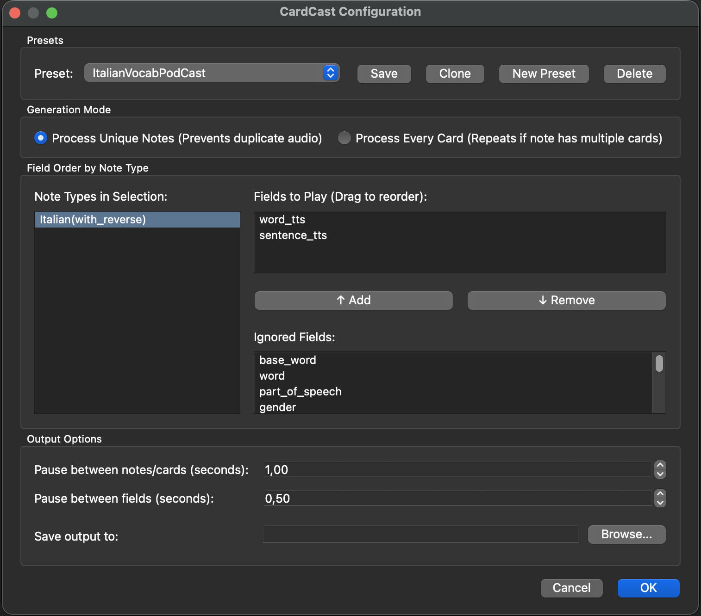

# CardCast for Anki

CardCast is an Anki add-on that allows you to batch-export the audio from your flashcards into a single, continuous MP3 file. 

> **Note:** CardCast *merges* existing audio fields. It does not generate Text-to-Speech (TTS) from plain text itself. If your cards only contain text, you will need to generate audio fields first using an add-on like [HyperTTS](https://ankiweb.net/shared/info/111623432).




## Why it exists
Reviewing flashcards usually requires staring at a screen. CardCast was built to make studying hands-free. By stitching together the audio fields of your cards (with customizable pauses in between), you can listen to your Anki card while commuting, walking, or at the gym.

## Prerequisites
To stitch the audio files together, this add-on requires **FFmpeg** to be installed on your system.
* **Mac:** Install via Homebrew: `brew install ffmpeg`
* **Windows/Linux:** Download from the [official FFmpeg site](https://ffmpeg.org/download.html) and ensure it is added to your system PATH.

## How to Use
1. Open the **Browse** window in Anki.
2. Select the cards you want to export.
3. Right-click the selected cards and choose **Generate CardCast Audio...**
4. In the dialog box:
   * Choose to process by Unique Notes or Every Card.
   * Drag and drop your audio fields into the exact order you want them played.
   * Set the pause durations (e.g., 0.5 seconds between fields, 1.0 seconds between cards).
   * Choose where to save the MP3.
5. Click **OK**. 

## Development Setup


### 1. Link to Anki
Instead of copying files back and forth, create a symbolic link (symlink) from this repository directly into Anki's add-on folder. 

**For Mac:**
```bash
ln -s /path/to/your/repo/cardcast "~/Library/Application Support/Anki2/addons21/cardcast"
```
*(Make sure Anki is closed and there isn't already a `cardcast` folder in the `addons21` directory before running this).*

### 2. Python Environment
1. Ensure you have `uv` installed.
2. In the root of this repository, run:
```bash
uv sync
```

Whenever you make changes to `cardcast/__init__.py`, simply restart Anki to see your changes live.


### 3. Building for Release
To package the add-on for sharing (via AnkiWeb or direct download), use the included build script. It will safely zip only the necessary files into a .ankiaddon package, ignoring your development environment.

Open your terminal in the root of the project repository.

```bash
chmod +x build.sh
```
This will generate a cardcast_release.ankiaddon file in your project folder, which is ready to be uploaded to AnkiWeb or shared directly.

Make the script executable (you only need to do this once):

## Disclaimer
This tool is being developed for personal use, quickly and mostly by AI. Please use at your own risk.

## License
This project is licensed under the MIT License.

